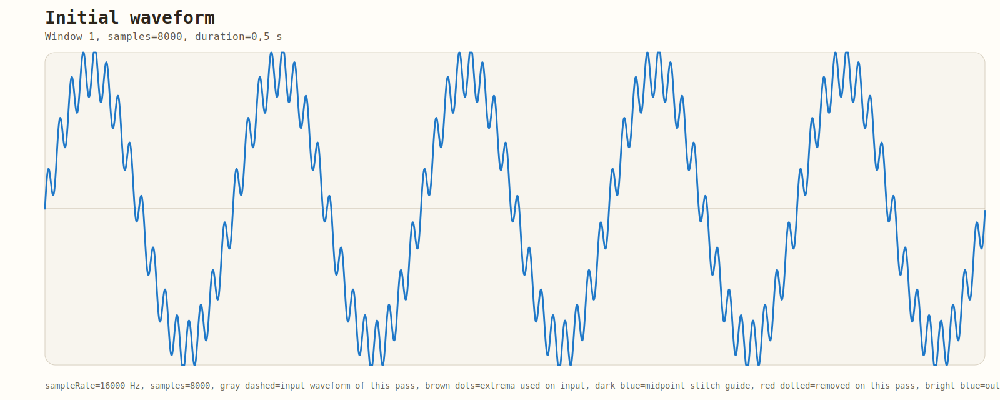
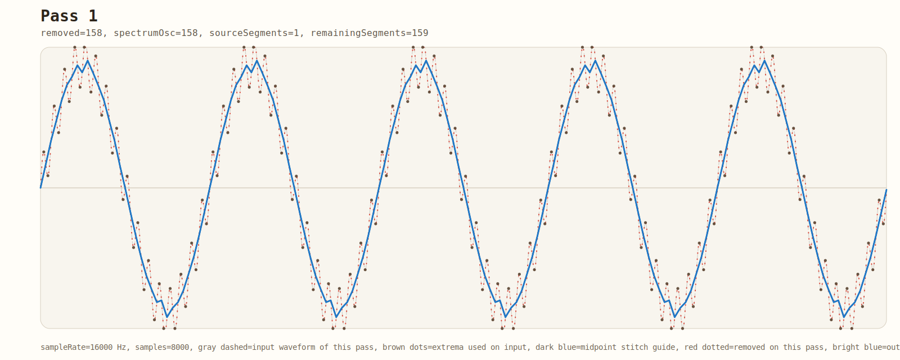
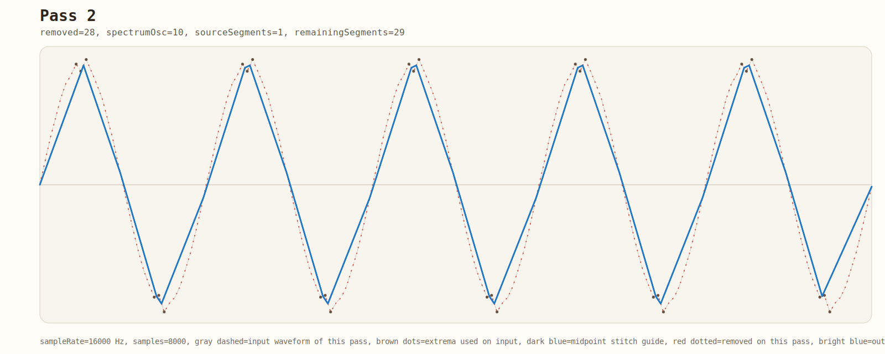

# ExtremaSpectrum

A .NET library for audio signal analysis using an **extrema-based oscillation decomposition** algorithm.

> **This is NOT an FFT spectrum.** The output represents the distribution of detected local oscillations by frequency — not mathematically orthogonal sinusoidal components. See the [Algorithm](#algorithm) section.

---

## Quick start

```csharp
using ExtremaSpectrum;

var analyzer = new ExtremaSpectrumAnalyzer(new ExtremaSpectrumOptions
{
    BinCount       = 128,
    MinFrequencyHz = 500f,
    MaxFrequencyHz = 8000f,
    MaxPasses      = 12
});

// float[] samples, int sampleRate already provided by your capture code
AnalysisResult result = analyzer.Analyze(samples, sampleRate);
float[] spectrum = result.Spectrum; // 128 bins, linear Hz spacing
```

### Streaming (microphone)

```csharp
var analyzer = new StreamingExtremaSpectrumAnalyzer(
    options,
    analysisWindowSamples: 2048,
    hopSamples: 512);

// In your audio callback:
if (analyzer.PushPcm16(buffer, format, out var result))
{
    float[] spectrum = result!.Spectrum;
}

// If your UI renders pass-by-pass geometry on its own:
if (analyzer.PushDetailedPcm16(buffer, format, out var report))
{
    IReadOnlyList<ExtremaPassSnapshot> passes = report!.Passes;
}
```

---

## Algorithm

The algorithm performs iterative decomposition of a discrete signal by local oscillations.

### Steps (one pass)

1. Find all local extrema (strict comparison, boundary points excluded).
2. Scan left-to-right for consecutive triples of the form **min→max→min** or **max→min→max**.
3. For each accepted triple *(left, mid, right)*:
   - `periodSamples = right − left`
   - `L = floor(midpoint(left, mid))`
   - `R = ceil(midpoint(mid, right))`
   - if the next accepted triple reuses the same slope, its left boundary starts from the already chosen `R`
   - `baseline = (signal[left] + signal[right]) / 2`
   - `amplitude = |signal[mid] − baseline|`
   - `frequencyHz = sampleRate / periodSamples`
4. If the oscillation passes the period and amplitude filters and maps into a valid frequency bin, its contribution is added to the spectrum.
5. The samples strictly between `L` and `R` are removed from later passes, while the midpoint boundary samples themselves are preserved.
6. The scan advances by one extremum, so adjacent accepted oscillations can share the same preserved midpoint boundary.

Multiple passes are performed until no valid triple is found or `MaxPasses` is reached.

### Extrema detection

```
local max:  signal[i−1] < signal[i]  &&  signal[i] >= signal[i+1]
local min:  signal[i−1] > signal[i]  &&  signal[i] <= signal[i+1]
```

Flat plateaus: the **first** point satisfying the comparison is taken as the extremum (deterministic).

### Frequency binning (LinearHz)

```
binWidth = (MaxFrequencyHz − MinFrequencyHz) / BinCount
binIndex = floor((frequencyHz − MinFrequencyHz) / binWidth)
```

---

## Limitations

- **Not FFT.** Bin values are accumulated oscillation amplitudes (or energies), not DFT coefficients.
- No windowing, no zero-padding, no spectral leakage correction.
- Frequency resolution improves with longer input buffers.
- The greedy left-to-right pass means oscillation overlap within one pass is not resolved.
- Results depend on signal amplitude; normalise input if absolute comparison is needed.

## Detailed trace and SVG export

`AnalyzeDetailed(...)` returns an `ExtremaAnalysisReport` with per-pass spectra, accepted oscillations, support ranges, and the input/output waveform snapshot for each pass.

The demo app can also export step-by-step SVGs:

```bash
dotnet run --project src/ExtremaSpectrum.Demo -- --input data/demo-low-010hz-plus-high-160hz.wav --export-step-images temp
```

Example frames generated from `data/demo-low-010hz-plus-high-160hz.wav`:







---

## Input formats

| Method | Format |
|---|---|
| `Analyze(ReadOnlySpan<float>, int)` | Normalised mono float, `[-1, +1]` |
| `AnalyzePcm16(ReadOnlySpan<byte>, AudioBufferFormat)` | Signed 16-bit PCM, little-endian |
| `AnalyzeFloat32(ReadOnlySpan<byte>, AudioBufferFormat)` | IEEE 754 32-bit float, little-endian |

Multi-channel buffers are mixed to mono before analysis according to `ChannelMixMode`:

| Mode | Behaviour |
|---|---|
| `FirstChannel` | Use channel 0 |
| `PreferredChannel` | Use `AudioBufferFormat.PreferredChannel` |
| `AverageAllChannels` | Arithmetic mean of all channels |

---

## Configuration

```csharp
new ExtremaSpectrumOptions
{
    BinCount        = 128,       // number of output frequency bins
    MinFrequencyHz  = 100f,      // lower bound of analysed range
    MaxFrequencyHz  = 8000f,     // upper bound of analysed range
    MaxPasses       = 16,        // iteration limit
    MinPeriodSamples = 2,        // ignore very short oscillations
    MaxPeriodSamples = 0,        // 0 = auto (input length)
    MinAmplitude    = 0f,        // amplitude threshold
    AccumulationMode = AccumulationMode.Amplitude   // or Energy
}
```

---

## License

MIT
